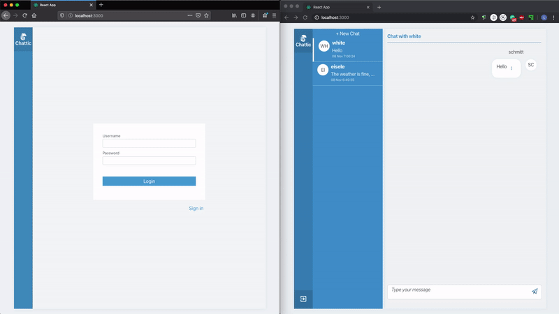

# Tutorial: Build your first web chat from A to Z

This tutorial was created to someone who is interested to build own *client-server web chat* using React, Apollo/GraphQl, and MongoDB



## Getting Started
These instructions will get you a copy of the project up and running on your local machine for development. Here is a quick look at how the project folder looks like ->

<sub><sup>(plan to do a little bit of refactoring so far )</sup></sub>

Server:

    |-- server
    |   |-- backpack.config.js
    |   |-- package.json
    |   |-- build
    |   |   |-- main.js
    |   |   |-- main.map
    |   |-- src
    |       |-- config.ts
    |       |-- main.ts
    |       |-- resolvers.ts
    |       |-- schema.ts
    |       |-- type-defs.ts
    |       |-- models
    |           |-- chatRoom.ts
    |           |-- message.ts
    |           |-- user.ts

Client: 

    |-- src
        |-- App.css
        |-- App.test.tsx
        |-- App.tsx
        |-- global.d.ts
        |-- index.css
        |-- index.tsx
        |-- logo.svg
        |-- react-app-env.d.ts
        |-- serviceWorker.js
        |-- apollo
        |   |-- client.ts
        |-- assets
        |   |-- images
        |       |-- logo.png
        |-- components
        |   |-- AuthFrom.tsx
        |   |-- ChatRoomMessages.tsx
        |   |-- ChatRooms.tsx
        |   |-- CreateChat.tsx
        |   |-- CreateMessage.tsx
        |   |-- Header.tsx
        |   |-- Layout.tsx
        |   |-- Message.tsx
        |   |-- Messages.tsx
        |   |-- Modal.tsx
        |   |-- Notification.tsx
        |   |-- Spinner.tsx
        |   |-- UpdateMessage.tsx
        |   |-- UserAvatar.tsx
        |-- graphql
        |   |-- mutations.ts
        |   |-- queries.ts
        |   |-- subscriptions.ts
        |-- hooks
        |   |-- hooks.ts
        |   |-- useInfiniteScroll.ts
        |-- pages
        |   |-- Chat.tsx
        |   |-- Login.tsx
        |   |-- NoMatch.tsx
        |   |-- Signup.tsx
        |-- stores
        |   |-- store.tsx
        |-- theme
        |   |-- index.ts
        |   |-- styled.tsx
        |   |-- styledComponents.tsx
        |   |-- theme.tsx
        |   |-- types.d.ts
        |-- utils
            |-- index.ts

### Prerequisites

You have to install and start your mongoDB locally

### Start the client
```
yarn start
```

### Start the server
```
cd server
yarn dev
```

## Built With

* [Apollo/GraphQL](https://www.apollographql.com/docs/) - The data graph framework used to connect client to backend services
* [MongoDB](https://www.mongodb.com/what-is-mongodb) - Database 
* [React](https://reactjs.org/docs/getting-started.html) - Used to build user interfaces
* [MobX](https://mobx-react.js.org/) - Used to handle application state
* [Emotion](https://emotion.sh/docs/introduction) - CSS-in-JS library for styling components

## Authors

* **Svitlana Yefremova** - *Initial work* - [SvetaYefremova](https://github.com/svetayefremova)

## TODO
* a step-by-step explanation of this tutorial

to be continued...